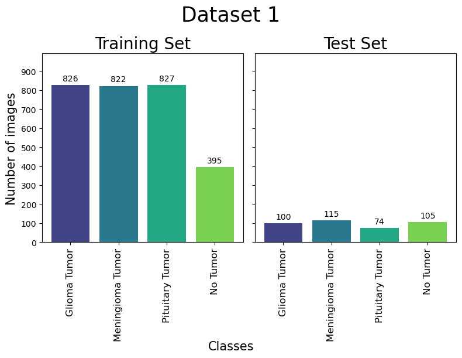
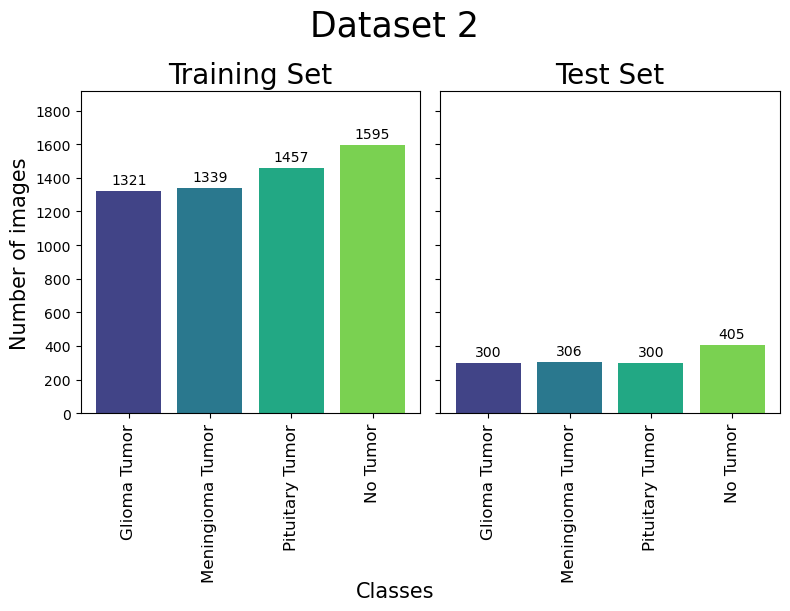
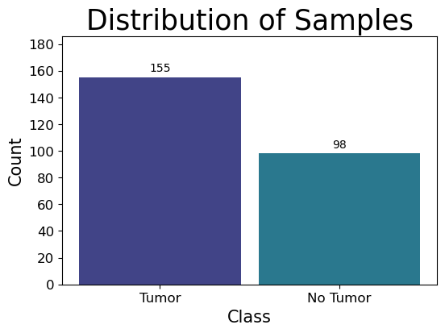
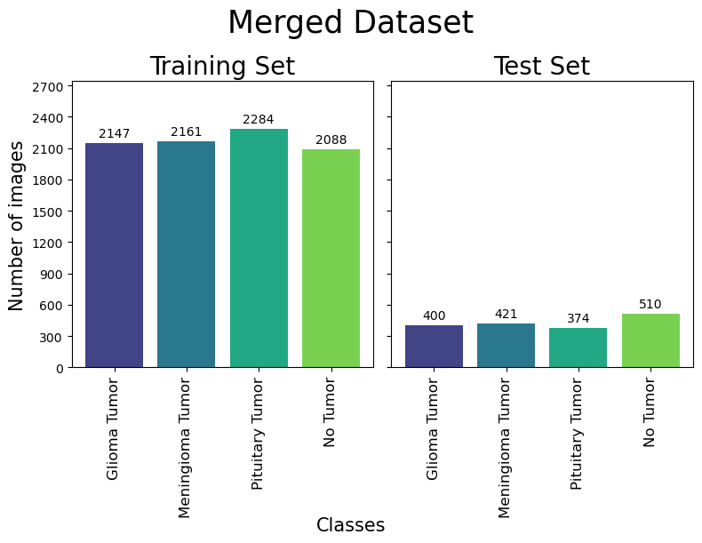
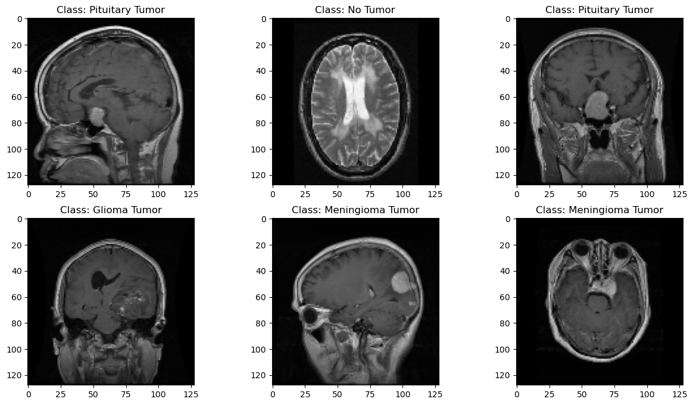

# Brain Tumor Classification
## Buisness Understanding 
### Background

## Data Understanding
The data used in this repository is a custom distribution that merges three datasets of images from Kaggle. The first source is from a Kaggle dataset named [Brain Tumor Classification (MRI)](https://www.kaggle.com/datasets/sartajbhuvaji/brain-tumor-classification-mri), the second dataset is named [Brain Tumor MRI Dataset](https://www.kaggle.com/datasets/masoudnickparvar/brain-tumor-mri-dataset), and lastly the third dataset is named [Brain MRI Images for Brain Tumor Detection](https://www.kaggle.com/datasets/navoneel/brain-mri-images-for-brain-tumor-detection).

Individually the dataset distributions are as shown in data distribution section as well as the merged dataset. All three datasets shared the labeled categories allow for a creation of a multi-classification deep learning model. The "[Brain MRI Images for Brain Tumor Detection](https://www.kaggle.com/datasets/navoneel/brain-mri-images-for-brain-tumor-detection)" dataset only had two categories but, using the 'no_tumor class was still useful information. The 'tumor' class was not for this dataset was not utilized for the classification problem.

### Data Distribution
|[Brain Tumor Classification (MRI)](https://www.kaggle.com/datasets/sartajbhuvaji/brain-tumor-classification-mri)|[Brain Tumor MRI Dataset](https://www.kaggle.com/datasets/masoudnickparvar/brain-tumor-mri-dataset)|
|-------|--------|
|||

[Brain MRI Images for Brain Tumor Detection](https://www.kaggle.com/datasets/navoneel/brain-mri-images-for-brain-tumor-detection)|Merged Dataset|
|-------|--------|
|||

## Data Preparation 
Before any modeling was conducted the images needed to be pre-processed in a manner where there all consistent for model training, testing, and validation. With that said, all images were treated in the following way using an Image Data generator from Keras:
1. Converted images from grayscale to 'RGB'.
2. Resized images to (128 x 128).
3. Normalized image pixel values on a consistent scale from 0 to 1.
4. Made labels for images with the following legend:
    * 'glioma': 0
    * 'meningioma': 1
    * 'no_tumor': 2
    * 'pituitary': 3

### Image Examples of Data Preparation

## Modeling 
### Base Model

|     Set    | Sensitivity/Recall | Specificity/Precision | Accuracy | Validation Loss/Generalization Capability |
|:----------:|:------------------:|:---------------------:|:--------:|:-----------------------------------------:|
|  Training  |       99.84%       |         99.85%        |  99.85%  |                   0.018                   |
|   Testing  |       90.79%       |         91.21%        |  91.14%  |                   0.647                   |
| Validation |       95.09%       |         95.64%        |  95.44%  |                   0.118                   |

### Developed Model (Version 07)

|     Set    | Sensitivity/Recall | Specificity/Precision | Accuracy | Validation Loss/Generalization Capability |
|:----------:|:------------------:|:---------------------:|:--------:|:-----------------------------------------:|
|  Training  |       99.94%       |         99.94%        |  99.94%  |                   0.013                   |
|   Testing  |       91.96%       |         92.01%        |  91.96%  |                   0.728                   |
| Validation |       98.09%       |         99.26%        |  98.09%  |                   0.091                   |

### Optimized Model (Utilizes Version 07)

|     Set    | Sensitivity/Recall | Specificity/Precision | Accuracy | Validation Loss/Generalization Capability |
|:----------:|:------------------:|:---------------------:|:--------:|:-----------------------------------------:|
|  Training  |       100.00%      |        100.00%        |  100.00% |                   0.003                   |
|   Testing  |       92.49%       |         92.98%        |  92.49%  |                   0.727                   |
| Validation |       97.92%       |         97.92%        |  97.92%  |                   0.086                   |

### Augmented Model (Utilizes Version 07 further trained on Augmented images)

|     Set    | Sensitivity/Recall | Specificity/Precision | Accuracy | Validation Loss/Generalization Capability |
|:----------:|:------------------:|:---------------------:|:--------:|:-----------------------------------------:|
|  Training  |       99.94%       |         99.97%        |  99.97%  |                   0.006                   |
|   Testing  |       92.37%       |         93.14%        |  92.37%  |                   0.584                   |
| Validation |       97.92%       |         97.98%        |  97.92%  |                   0.081                   |

## Conclusion

### Next Steps