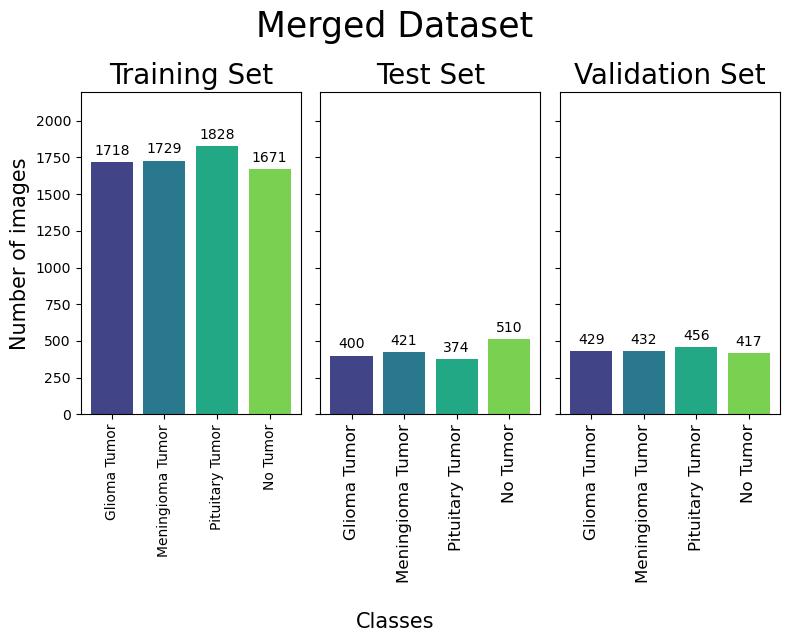

# Brain Tumor Classification
## Buisness Understanding 
### Background

## Data Understanding
The data used in this repository is a custom distribution that merges three datasets of images from Kaggle. The first source is from a kaggle dataset named [Brain Tumor Classification (MRI)](https://www.kaggle.com/datasets/sartajbhuvaji/brain-tumor-classification-mri), the second dataset is named [Brain Tumor MRI Dataset](https://www.kaggle.com/datasets/masoudnickparvar/brain-tumor-mri-dataset), and lastly the third dataset is named [Brain MRI Images for Brain Tumor Detection](https://www.kaggle.com/datasets/navoneel/brain-mri-images-for-brain-tumor-detection).

Individualy the dataset distributions are as shown in data distribution section as well as the merged dataset. All three datasets shared the labeled vategories allow for a creation of a multiclassification deep learning model. The "[Brain MRI Images for Brain Tumor Detection](https://www.kaggle.com/datasets/navoneel/brain-mri-images-for-brain-tumor-detection)" dataset only had two categories but, using the 'no_tumor classs was still useful information. The 'tumor' class was not for this dataset was not utilized for the classification problem.

### Data Distribution
|[Brain Tumor Classification (MRI)](https://www.kaggle.com/datasets/sartajbhuvaji/brain-tumor-classification-mri)|[Brain Tumor MRI Dataset](https://www.kaggle.com/datasets/masoudnickparvar/brain-tumor-mri-dataset)|
|-------|--------|
|||

[Brain MRI Images for Brain Tumor Detection](https://www.kaggle.com/datasets/navoneel/brain-mri-images-for-brain-tumor-detection)|Merged Dataset|
|-------|--------|
|||

## Data Preparation 

## Modeling 

## Conclusion

### Next Steps