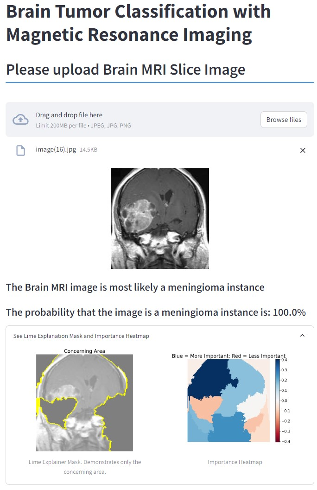

# Brain Tumor Classification
## Background
Brain cancer is one of the top 10 cancers that can lead to death (Gao & Jiang, 2013). A brain tumor is defined as "unexpected growth of brian cells" (Reham Kaifi, 2023). The World Health Organization (WHO) has categorized brain tumors into 120 categories. This categorization is all based on the cell's origin and behavior that can range from less aggressive to greater aggressive (Reham Kaifi, 2023). There are only two types of brain tumors if they are based on nature. These two types of brain tumors would be Benign and Malignant. Benign are less aggressive and grow slowly while malignant are life threatening and rapidly grow (Reham Kaifi, 2023). To be more descriptive there are normally four tumor grades shown in the table below when it comes to describing their behavior.

|  Grading  |                                     Definition                                    |
|:---------:|:---------------------------------------------------------------------------------:|
|  Grade I  | Tumor has a regular symmetric shape. Adding on, it develops slowly.               |
|  Grade II | Tumor appears strange and unsymmetrical/disoriented. The tumor also grows slowly. |
| Grade III | These tumors are described as grade II but they grow faster than grade II tumors. |
|  Grade IV | Has a high growth rate                                                            |

Aside from a grade every tumor has a primary type and a subtype which is based on the region of the brain (J. Ricardo McFaline-Figueroa & Lee, 2018). Although they may have a certain grade due to their nature, there are brain tumors that are much more common than others. In this context there are only 3 primary lesion cases that are explored. The three brain lesion cases are pituitary, meningioma, and glioma. The fourth case is an absence of a brian tumor or in other words a true negative patient. The subtypes are not explored due to the lack of data labeling on the tumor subtypes.

Meningiomas are mostlty benign and slow growing tumors. These tumors originate from meningothelial cells and are the most common primary brain tumor (J. Ricardo McFaline-Figueroa & Lee, 2018). Most meningioma according to the data collected by the WHO are grades I-III based on histology data (J. Ricardo McFaline-Figueroa & Lee, 2018). Adding on, grade I meningiomas are the most favorable situation as they generally are associated with better outcomes compared to higher grade variants. They have slow growth rates, low likelihood of invasion of surrouding tissue, good treatement response, low risk of recurrence, and have long-term survival outcomes.

Gliomas are the most common primary malignant tumors of the central nervous system. Gliomas arise from glial cells and the most common subtype are glioblastomas. Glioblastomas are a grad IV astrocytoma. Gliomas in general are very difficult to treat (J. Ricardo McFaline-Figueroa & Lee, 2018).

Pituitary tumors grow in the pituitary gland which is located near the base of the brain below the hypothalamus. Most cases of pituitary tumors are benign. They grow slow and are not malignant. The main isue with a tumor located in the pituiatry gland is the disruption of the bodies natural harmone production. (National Institutes of Health, 2023).

The gold standard protocol for assessment relies on MRI (Magnetic Resonance Imaging) imaging and the neurologists would take these images and examine them from the coronal, sagittal, and axial planes (Reham Kaifi, 2023). The process continues as the requirement for some computer vision sequence known as FLAIR is required to modify the images in order to get rid of the spinal fluid noise signals from the imaging which creates MRI imaging as shown in the image examples within the [Data Preparation](https://github.com/cristopher-d-delgado/brain_tumor_classification#data-preparation) section.

Following the biomedical imaging a biopsy is required in order to make a final diagnosis on the tumor type and grade. A pathologist would examine the tissue sample in order to determine if cancer is present. The sample is usually taken during surgery when removing the entire tumor (Brain Tumor - Diagnosis, 2012). 

## Business Understanding  
Traditional diagnostic methods involve an MRI and a biopsy which can be only as effective as the expert interpretation and time consuming. The gold standard requires an expert to make the assessment and laboratory testing to determine brain tumor type and grade. 

Utilizing a machine learning algorithm such as Deep Neural Networks can not only address this issue but enhance diagnostic accuracy, reduce interpretation time, and improve patient outcomes. [Siemens Healthineers](https://www.siemens-healthineers.com/en-us) is a global company that invests in all areas of healthcare products such as medical imaging devices, point-of-care products, and digital platforms.

Siemens is looking to incorporate machine learning algorithms into there MRI portfolio. Where there MRI technology can not only provide diagnostic images for experts but also provide insightful diagnostic information in regards to cancer diagnostics. Although there are many areas in the body that can show as cancerous they are wanting to slowly incorporate all areas into their portfolio over time.

**The objective would be to develop a diagnostic tool that can create insights for diagnosing brain tumors. This model would aim to classify such tumors and provide insight in addition to classification to help aid in diagnosis and treatment. Adding on, the model should prioritize Sensitivity as capturing the most positive cases is important because misclassifying a tumor case as no tumor is far worse than incorrectly classifying a no tumor case as a tumor.**

## Data Understanding
The data used in this repository is a custom distribution that merges three datasets of images from Kaggle. The first source is from a Kaggle dataset named [Brain Tumor Classification (MRI)](https://www.kaggle.com/datasets/sartajbhuvaji/brain-tumor-classification-mri), the second dataset is named [Brain Tumor MRI Dataset](https://www.kaggle.com/datasets/masoudnickparvar/brain-tumor-mri-dataset), and lastly the third dataset is named [Brain MRI Images for Brain Tumor Detection](https://www.kaggle.com/datasets/navoneel/brain-mri-images-for-brain-tumor-detection).

Individually the dataset distributions are as shown in [Data Distribution](https://github.com/cristopher-d-delgado/brain_tumor_classification#data-distribution) section as well as the merged dataset. All three datasets shared the labeled categories allow for a creation of a multi-classification deep learning model. The "[Brain MRI Images for Brain Tumor Detection](https://www.kaggle.com/datasets/navoneel/brain-mri-images-for-brain-tumor-detection)" dataset only had two categories but, using the 'no_tumor class was still useful information. The 'tumor' class was not for this dataset was not utilized for the classification problem.

The data used in this repository uses three tumor classifications which are glioma, meningioma, and pituitary tumors. As mentioned before there are a range of grades however the data is not labeled in such a way in which we can utilize such information for classification. In other words, the only information we have for every tumor is its label and image. 

### Data Distribution
|[Brain Tumor Classification (MRI)](https://www.kaggle.com/datasets/sartajbhuvaji/brain-tumor-classification-mri)|[Brain Tumor MRI Dataset](https://www.kaggle.com/datasets/masoudnickparvar/brain-tumor-mri-dataset)|
|-------|--------|
|||

[Brain MRI Images for Brain Tumor Detection](https://www.kaggle.com/datasets/navoneel/brain-mri-images-for-brain-tumor-detection)|Merged Dataset|
|-------|--------|
|||

## Data Preparation 
Before any modeling was conducted the images needed to be pre-processed in a manner where there all consistent for model training, testing, and validation. With that said, all images were treated in the following way using an Image Data generator from Keras:
1. Converted images from grayscale to 'RGB'.
2. Resized images to (128 x 128).
3. Normalized image pixel values on a consistent scale from 0 to 1.
4. Made labels for images with the following legend:
    * 'glioma': 0
    * 'meningioma': 1
    * 'no_tumor': 2
    * 'pituitary': 3

### Image Examples of Data Preparation

## Modeling 
During training of the deep neural networks there were 5 metrics that were being monitored: Sensitivity, Specificity, Accuracy, Validation Loss, and Training Loss. Adding on, a model evaluation was also conducted to view performance on the test dataset allowing for overall assessment of model generalization and performance.

For each model iteration found in the [notebook](https://github.com/cristopher-d-delgado/brain_tumor_classification/blob/main/notebook.ipynb), the first step is always to define the model architecture followed by a training session using that defined architecture. The model training was conducted by a function called 'train_model()'. 

Adding on, there are graphs that plot the training loss vs validation loss (Loss vs Epoch), training recall & precision (Train Recall & Precision vs Epoch), validation recall & precision (Validation Recall & Precision), and lastly the accuracy (Accuracy vs Epoch) during model training. This is supplied by the 'view_history()' function. 

The last step was to conduct an overall assessment of the model by testing it on unseen data which is the testing data. This was conducted using the 'model_evaluate()' function. 

There were many model iterations however only 4 iterations are considered vital pivot points in the model iterations. This would be the base_model, the developed version 07 model, the optimized version of the same model, and the augmented model version. All of these models are summarized below.

*All the function can be found [here](https://github.com/cristopher-d-delgado/brain_tumor_classification/blob/main/functions.py)

### Base Model

|     Set    | Sensitivity/Recall | Specificity/Precision | Accuracy | Validation Loss/Generalization Capability |
|:----------:|:------------------:|:---------------------:|:--------:|:-----------------------------------------:|
|  Training  |       99.84%       |         99.85%        |  99.85%  |                   0.018                   |
|   Testing  |       90.79%       |         91.21%        |  91.14%  |                   0.647                   |
| Validation |       95.09%       |         95.64%        |  95.44%  |                   0.118                   |

### Developed Model (Version 07)

|     Set    | Sensitivity/Recall | Specificity/Precision | Accuracy | Validation Loss/Generalization Capability |
|:----------:|:------------------:|:---------------------:|:--------:|:-----------------------------------------:|
|  Training  |       99.94%       |         99.94%        |  99.94%  |                   0.013                   |
|   Testing  |       91.96%       |         92.01%        |  91.96%  |                   0.728                   |
| Validation |       98.09%       |         99.26%        |  98.09%  |                   0.091                   |

### Optimized Model (Utilizes Version 07)

|     Set    | Sensitivity/Recall | Specificity/Precision | Accuracy | Validation Loss/Generalization Capability |
|:----------:|:------------------:|:---------------------:|:--------:|:-----------------------------------------:|
|  Training  |       100.00%      |        100.00%        |  100.00% |                   0.003                   |
|   Testing  |       92.49%       |         92.98%        |  92.49%  |                   0.727                   |
| Validation |       97.92%       |         97.92%        |  97.92%  |                   0.086                   |

### Augmented Model (Utilizes Version 07 further trained on Augmented images)

|     Set    | Sensitivity/Recall | Specificity/Precision | Accuracy | Validation Loss/Generalization Capability |
|:----------:|:------------------:|:---------------------:|:--------:|:-----------------------------------------:|
|  Training  |       99.94%       |         99.97%        |  99.97%  |                   0.006                   |
|   Testing  |       92.37%       |         93.14%        |  92.37%  |                   0.584                   |
| Validation |       97.92%       |         97.98%        |  97.92%  |                   0.081                   |

### Model Deployment 
I have created a Streamlit application that utilizes the best model which was the **Augmented model**. This application works by passing in an image and the application will provide the model prediction in addition to diagnostic information.

#### Streamlit App
To access the application please click [here](https://cristopher-d-delgado-brain-tumor--streamlitstreamlit-app-cu4g1w.streamlit.app/)

The following image is an example of the application itself: 

## Conclusion
The best model was the augmented model because this model achieved the best Recall/Sensitivity while still having the best generalization to unseen data. This was determined from its low validation loss to the testing data. This model had a Sensitivity of about 92% and Specificity of about 93%. Overall the model performs very well but, struggles in the No Tumor classification and Meningioma.

There are 54 instances where the model classifies the image as a tumor (glioma: 40, meningioma: 4, pituitary: 10) when it should have been a no_tumor classification. There are 63 instances where the model mis-classifies the image (glioma: 49, no_tumor: 2, pituitary_tumor) when it should have been meningioma_tumor. This information is also represented in the confusion matrix below.

In conclusion, the best model architecture is demonstrated below in the [Final Model Architecture Section](https://github.com/cristopher-d-delgado/brain_tumor_classification#final-model-architecture) and its performance on the test data under the [Model Performance](https://github.com/cristopher-d-delgado/brain_tumor_classification#model-performance) section. The model does very well with unseen data with over 90% accuracy.

**My recommendation would be to utilize this model in assisting for brain tumor classification as well as providing insights for diagnosis**

### Final Model Architecture

### Model Performance

### Next Steps

1. Keep training the model on new images to achieve a better classification performance for meningioma and no_tumor images. Adding on, the model can be trained specifically only those instances in hopes to improve its learning capability for them.

2. Change the diagnostic apporoach. Currently uses LIME but, there are methods to use the last Convolutional layer and upsampling to mask over the original image. There is a possibility this segments the tumors in a better way. 

## References 
1. Brain Tumor - Diagnosis. (2012, June 26). Cancer.net. https://www.cancer.net/cancer-types/brain-tumor/diagnosis

2. Gao, H., & Jiang, X. (2013). Progress on the diagnosis and evaluation of brain tumors. Cancer Imaging, 13(4), 466–481. https://doi.org/10.1102/1470-7330.2013.0039

3. Reham Kaifi. (2023). A Review of Recent Advances in Brain Tumor Diagnosis Based on AI-Based Classification. Diagnostics, 13(18), 3007–3007. https://doi.org/10.3390/diagnostics13183007

4. J. Ricardo McFaline-Figueroa, & Lee, E. Q. (2018). Brain Tumors. The American Journal of Medicine, 131(8), 874–882. https://doi.org/10.1016/j.amjmed.2017.12.039 

5. National Institutes of Health. "Pituitary Tumors". National Institute of Neurological Disorders and Stroke. https://www.ninds.nih.gov/health-information/disorders/pituitary-tumors. Last updated November 28, 2023.